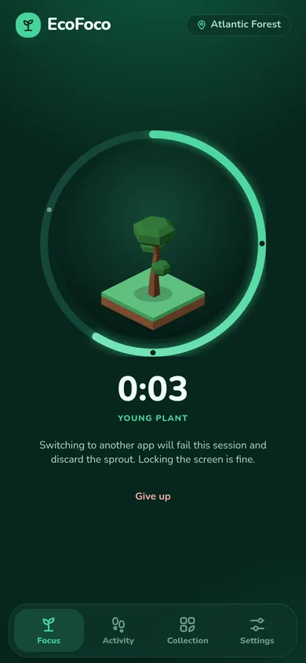
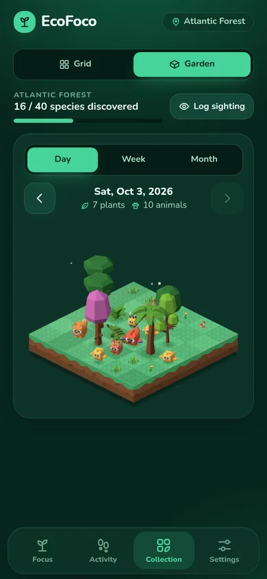
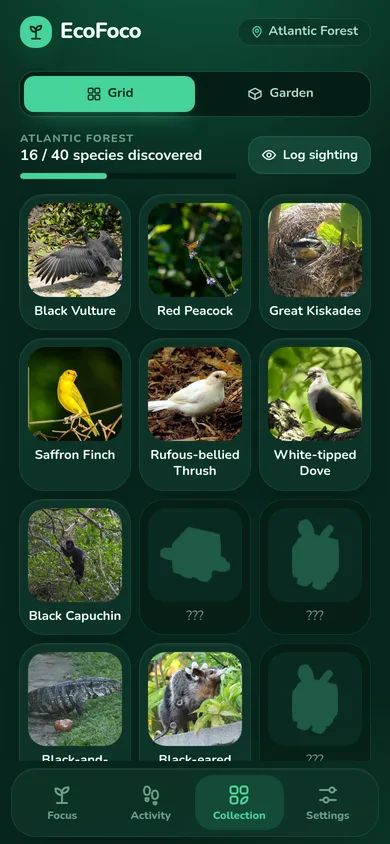
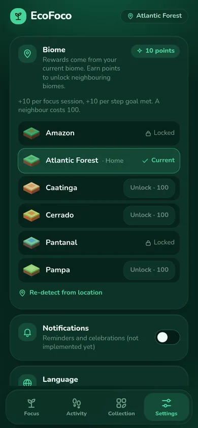

# EcoFoco

A focus app for Android that turns time off your phone and steps outside into a collection of real Brazilian plants and animals.

- **Focus → plants.** Start a focus session and a sprout grows on screen. Stay in the app until the timer ends and it becomes a permanent plant in your collection; leave early and it's lost.
- **Walk → animals.** Meet your daily step goal (read from Health Connect) and you get one animal draw per day, weighted by rarity.
- **Your biome.** Species come from the biome you live in, found from a coarse location fix. Points from focus sessions and step goals unlock neighbouring biomes.

EcoFoco is a personal project, built as a fullstack portfolio piece. It runs entirely on-device: no account, no backend.

## Features

- Focus sessions of 3, 15, 25 or 45 minutes, with a sprout that grows through four stages into the shape of the plant you'll collect; leaving the app fails the session.
- Daily step goal (default 6,000, adjustable in steps of 500) from Health Connect, with one rarity-weighted animal draw per day.
- Manual sighting log for plants and animals you've seen in real life.
- Collection grid (a Pokédex of the current biome, collected and missing) and an animated isometric garden of what you collected in a given day, week or month, with ground and decoration per biome.
- Species detail sheet with photo, description, photo credit and collection history; a celebration whenever something new is collected.
- Location-based biomes for Brazil's six IBGE biomes: coarse location only, used once and never stored (only the biome id is kept), with a manual picker as fallback.
- Points from completed sessions and met step goals (10 each); 100 points unlock a neighbouring biome, and you can switch to any unlocked one.
- Bundled catalog for all six biomes, about 20 plants and 20 animals each, photos included.
- English and Portuguese (Brazil), including species names and descriptions.

## Screenshots

| Focus | Garden | Collection | Settings |
|---|---|---|---|
|  |  |  |  |

The whole app re-tints with the current biome; before/after shots of every screen are in [`docs/visual-polish.md`](docs/visual-polish.md).

## Stack

- **App:** Capacitor 8, Vite, React 19, TypeScript, Tailwind CSS 4 (design tokens per biome), Zustand, i18next
- **On-device data:** SQLite (`@capacitor-community/sqlite`; `jeep-sqlite`/sql.js in the browser)
- **Native plugins:** Health Connect steps (`@capgo/capacitor-health`), coarse geolocation, app lifecycle, haptics, local AwayTracker (Kotlin; time spent in other apps with the screen on)
- **Tooling:** Vitest, Oxlint, GitHub Actions (lint, tests, build, debug APK, manifest permission checks)

## Quick start

Requires Node 22.

```sh
cd app
npm ci
npm run dev      # dev server in the browser
npm test         # unit tests
npm run lint
npm run build
```

Health Connect and location don't exist in the browser, so the step and location features only work on a device. More details, including how to regenerate the biome lookup grid, are in [`app/README.md`](app/README.md).

## Install on Android

Every CI run builds a debug APK and uploads it as the `ecofoco-debug-apk` artifact. With the GitHub CLI and `adb`:

```sh
gh run list --workflow CI --branch main --status success --limit 1
gh run download <run-id> -n ecofoco-debug-apk
adb install -r app-debug.apk
```

Requires Android 8.0+, USB debugging, and Health Connect for step counts. To build the APK yourself, see [`app/README.md`](app/README.md#local-build).

## Roadmap

What is shipped and what is planned — a native focus lock (screen overlay plus app-usage monitoring), further visual polish — is in the [PRD](PRD.md#6-roadmap). Domain terms are defined in [`CONTEXT.md`](CONTEXT.md).

## Credits and licenses

- **Biome map:** derived from RESOLVE Ecoregions 2017 (Dinerstein et al., 2017, *BioScience* 67(6)), licensed [CC-BY 4.0](https://creativecommons.org/licenses/by/4.0/). Details and changes: [`app/src/assets/biomes/LICENSE.md`](app/src/assets/biomes/LICENSE.md).
- **Species photos:** from research-grade iNaturalist observations, each licensed CC0 or CC-BY and credited in the app (species detail sheet and Settings → Credits). Details: [`app/src/assets/species/LICENSE.md`](app/src/assets/species/LICENSE.md).
- **Garden sprites:** baked from [Kenney](https://www.kenney.nl) 3D kits (Nature Kit, Cube Pets) plus two original models, all [CC0 1.0](http://creativecommons.org/publicdomain/zero/1.0/). Details: [`app/src/assets/garden/LICENSE.md`](app/src/assets/garden/LICENSE.md).
- **Font:** [Nunito](https://github.com/googlefonts/nunito), [SIL OFL 1.1](app/src/assets/fonts/OFL.txt).

No license has been chosen for EcoFoco's own code yet.
