# Visual polish pass (October 2026)

What changed in the first app-wide visual pass, the numbers behind its decisions, and what is left. Screenshots are
390×844 phone frames from the web build, in `screenshots/visual-polish/`.

## Before and after

| Screen | Before | After |
|---|---|---|
| Onboarding / biome picker | 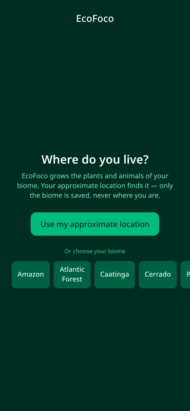 | 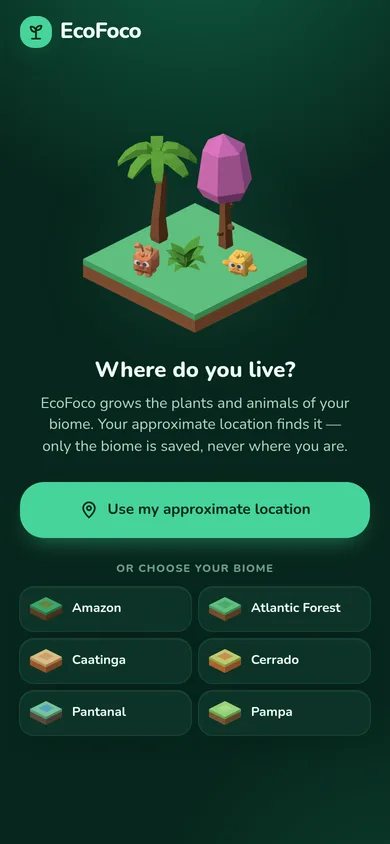 |
| Focus: choose duration | 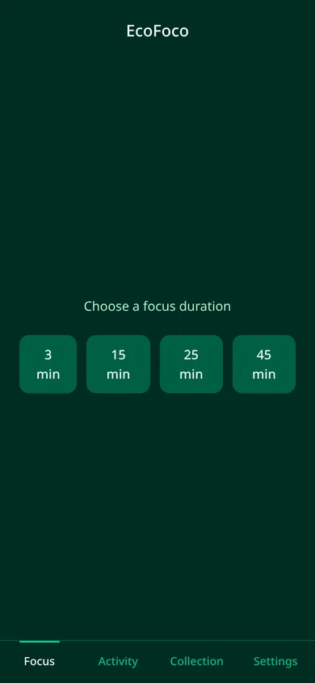 | 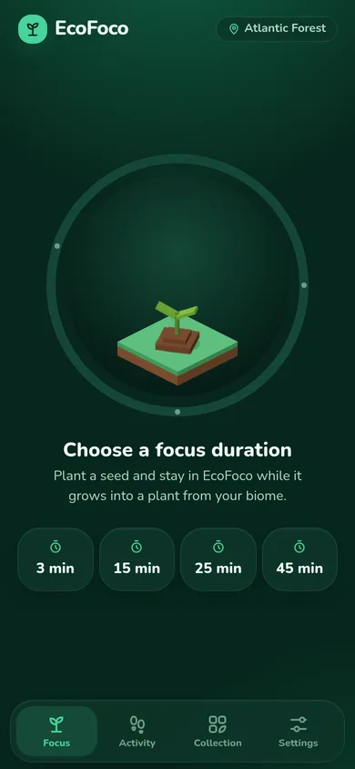 |
| Focus: running | 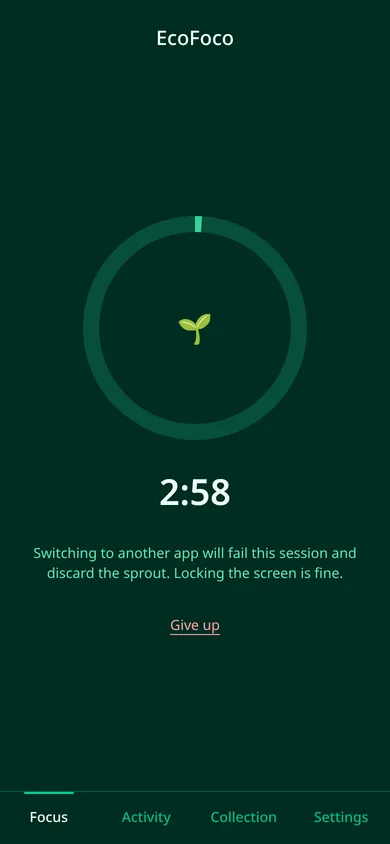 |  |
| Celebration | 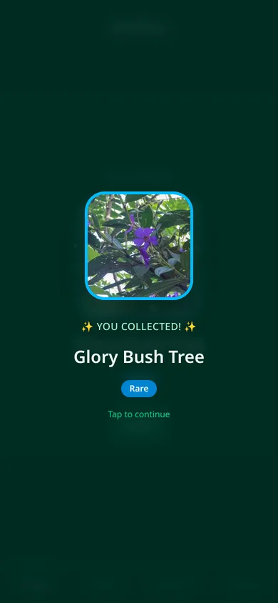 | 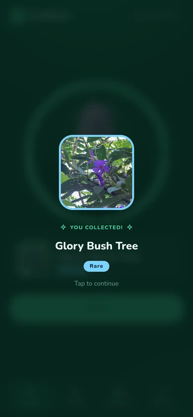 |
| Focus: completed | 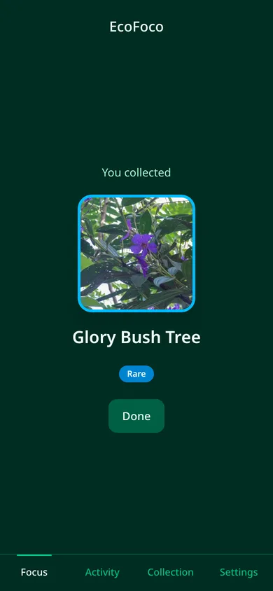 | 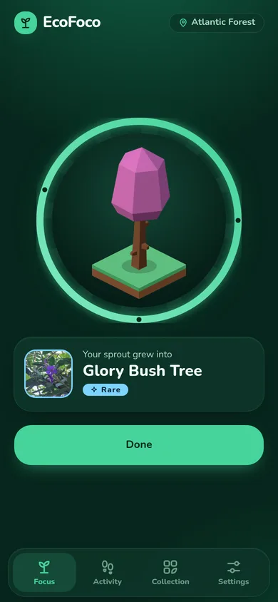 |
| Focus: failed | 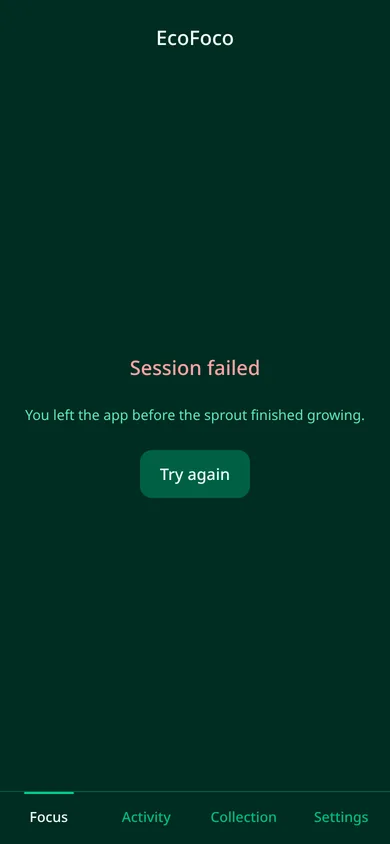 | 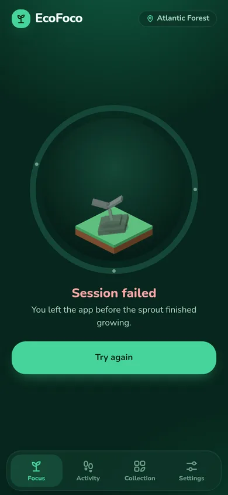 |
| Activity: no Health Connect | 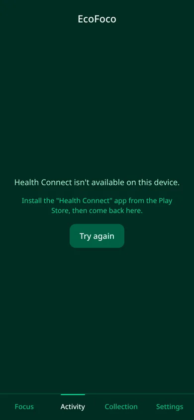 | 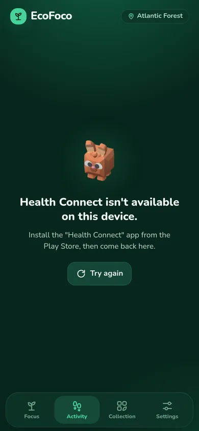 |
| Activity: walking | 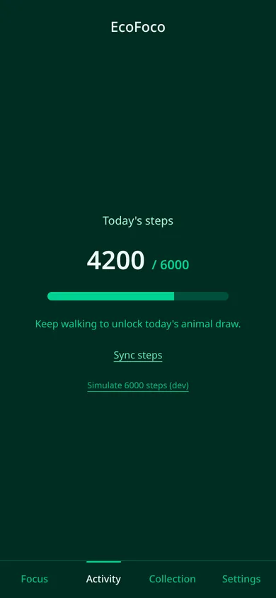 | 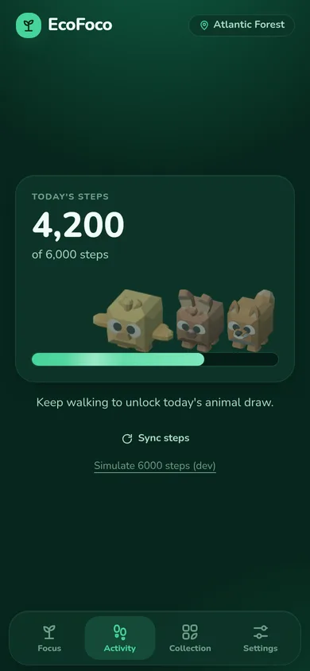 |
| Activity: goal met | 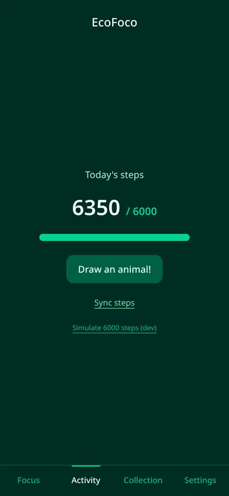 | 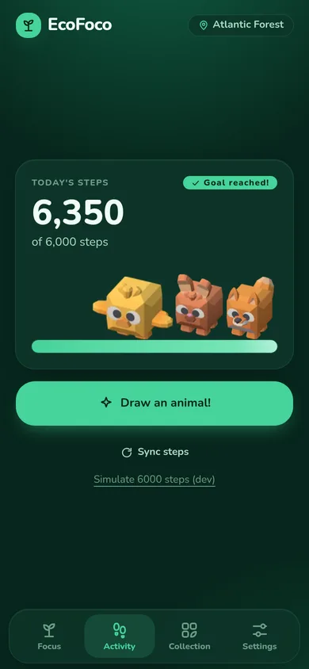 |
| Collection: grid | 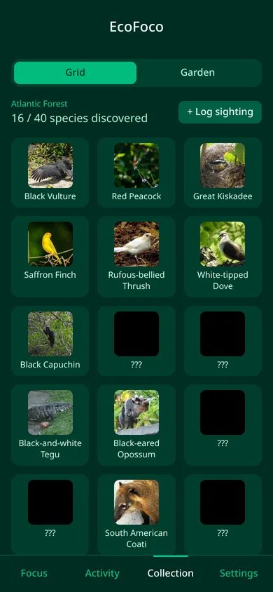 |  |
| Collection: garden | 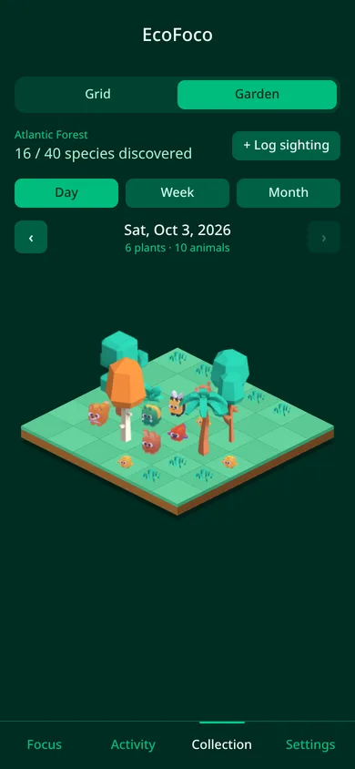 |  |
| Garden: Caatinga | 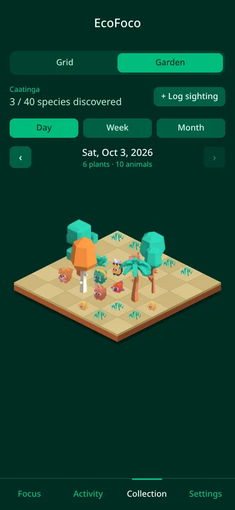 | 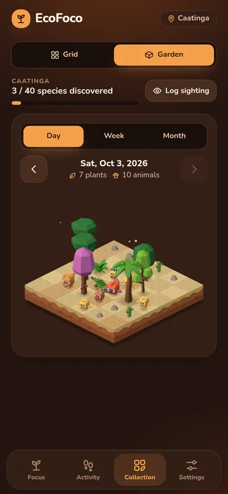 |
| Garden: Pantanal | 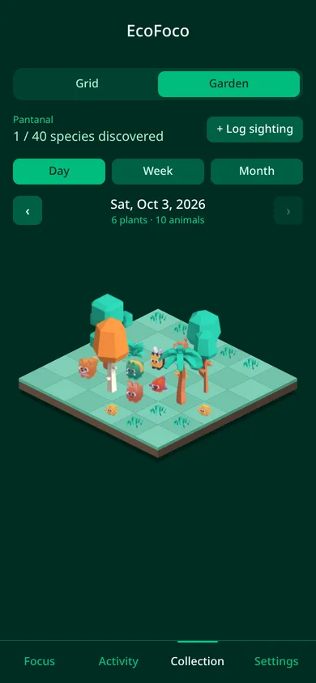 | 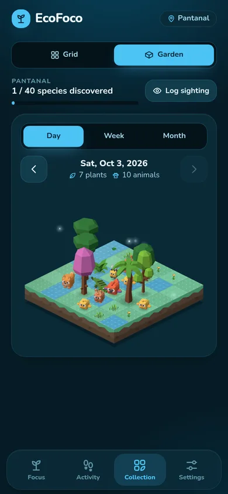 |
| Species sheet | 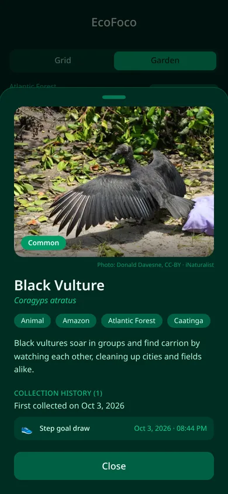 | 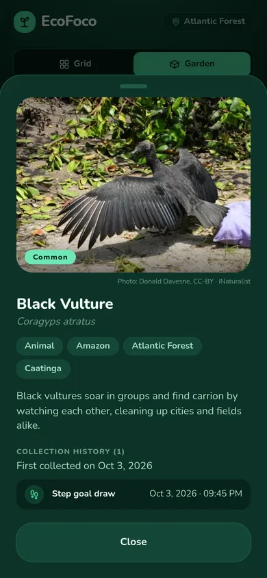 |
| Settings | 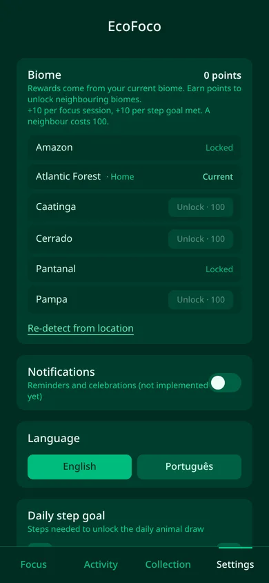 |  |

The Sprout's four growth stages, from one session: [seedling](screenshots/visual-polish/after-focus-running.webp),
[sapling](screenshots/visual-polish/after-focus-running-stage1.webp),
[young plant](screenshots/visual-polish/after-focus-running-stage2.webp),
[almost grown](screenshots/visual-polish/after-focus-running-stage3.webp).

## Decisions

- **Design tokens per Biome.** Screens use only semantic Tailwind tokens (`bg-surface`, `text-ink-muted`,
  `rounded-card`, `px-gutter`, `text-title`…) defined in `src/index.css`. `App` sets `<html data-biome>`, and each
  Biome swaps the colour values, so the whole app re-tints when the current Biome changes. Rarity colours stay
  the same everywhere. Shared building blocks (buttons, cards, segmented controls, empty states, icons) live in
  `src/components/ui.tsx` and `icons.tsx`.
- **Garden stays DOM/CSS.** Every idle motion is a transform or opacity animation, so it runs on the compositor.
  Measured in headless Chrome at 390×844, CPU throttled, over 6 s (steady) or 1.5 s after a tap (period switch):

  | Case | 1× | 4× | 6× |
  |---|---|---|---|
  | 64 animated sprites, steady | 60.2 fps | 60.2 fps | 60.2 fps (p95 frame 16.8 ms) |
  | 64 sprites, switching day/week/month | 60 fps | 55 fps, worst frame ~130 ms | 50–51 fps, worst frame ~200 ms |
  | 24 entries + decoration, switching | – | – | 56 fps, worst frame ~115 ms |

  The only long frame is React remounting the plot on a period switch, which a canvas renderer would not
  remove. PixiJS stays a later swap if real devices drop under ~50 fps.
- **Art is baked, not drawn.** `npm run bake:garden` renders CC0 Kenney 3D models (and two original models)
  through one orthographic camera with three.js in headless Chrome. See `app/README.md#garden-sprites`.
- **The plant is drawn at session start**, so the Sprout can grow into its Archetype's shape. It is still only
  collected when the session completes.
- **Reduced motion.** With `prefers-reduced-motion: reduce`, no animation runs on Focus or in the garden (checked
  with `document.getAnimations()`), the particles and cloud are hidden, and every state change still shows.
- **Bundle cost vs. main**: JS +23 KB (+5 KB gzip), CSS +15 KB (+3 KB gzip), the Nunito font +39 KB (latin
  subset only), garden sprites 113 KB (was 49 KB, for 21 sprites instead of 14). No new npm dependencies.

## Still open

Follow-up visual work is tracked in the [PRD roadmap](../PRD.md#6-roadmap). The frame rates above still need
checking on a low-end Android device.
